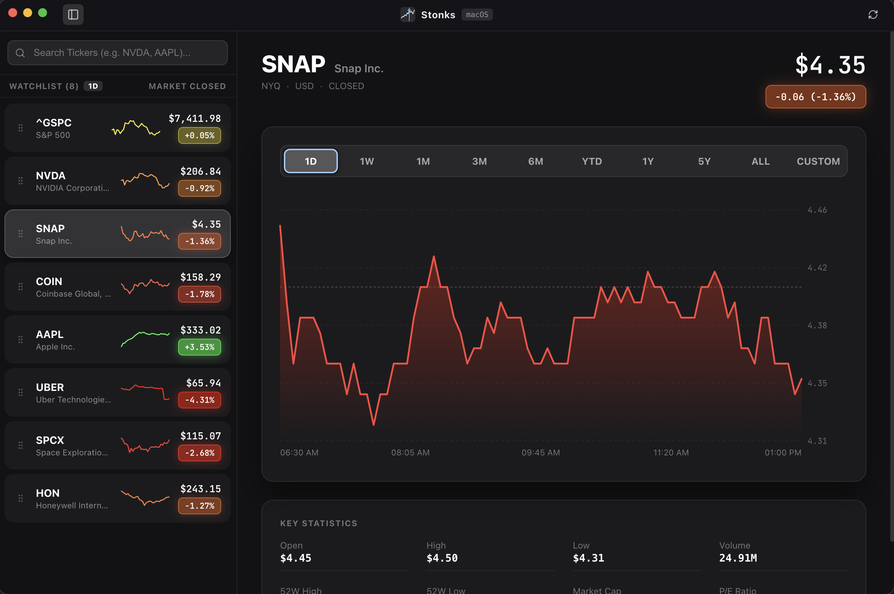

<p align="center">
  
</p>

<h1 align="center">Stonks</h1>

<p align="center">
  <strong>A native macOS-inspired stock tracking & financial analytics desktop and mobile application.</strong>
</p>

<p align="center">
  <a href="https://orangechuice.github.io/stonks-app-public/" target="_blank">
    
  </a>
</p>

<p align="center">
  
  
  
  
  
  <a href="https://ko-fi.com/orangechuice" target="_blank"></a>
</p>

---

## 📸 Overview

**Stonks** delivers a sleek, responsive, and native stock monitoring experience built with Electron, Capacitor, React, TypeScript, and Vite. Designed specifically with macOS design principles and responsive mobile bottom-sheets in mind, it provides real-time market quotes, detailed interactive charts, customizable watchlist drag-and-drop ordering, and key stock metrics on macOS, Web, and Android.

<p align="center">
  
</p>

> [!IMPORTANT]
> **💻 Native macOS Desktop & 📱 Android Applications are Recommended!!**
> While a live web version is hosted on [GitHub Pages](https://orangechuice.github.io/stonks-app-public/), web browsers block direct cross-origin requests to financial data APIs, requiring web traffic to route through public CORS proxies (`corsproxy.io`, `allorigins.win`). Heavy web traffic or frequent timeframe switching can occasionally hit public CORS proxy rate limits (`HTTP 429`).
> 
> **For the fastest, unthrottled experience with 100% data reliability, run the native macOS application (`npm run electron:dev` / `.dmg`) or the Android app (`.apk`)**, which execute requests natively without CORS proxy throttling!

---

## ✨ Features

- ** Native macOS & 📱 Android Experience**: Built with a sleek dark-mode palette (`#0E0E10`), frameless inset title bar on desktop, native status bar, and swipe-down bottom detail sheets on mobile devices.
- **📊 Interactive Stock Charts**: View market trends across flexible timeframes (`1D`, `1W`, `1M`, `3M`, `6M`, `YTD`, `1Y`, `5Y`, `ALL`, `CUSTOM`) complete with dynamic SVG line gradients, range axes, hover tooltips, price crosshairs, and custom start/end date range selection.
- **📅 Custom Date Ranges**: Select any custom start and end date (including single full trading days or multi-day periods) to calculate price changes and render custom charts.
- **🟢 Dynamic Color Indicators**: Visual feedback that dynamically adapts gradient overlays and badge highlights—emerald green (`#30D158`) for gains and ruby red (`#FF453A`) for market dips.
- **⚡ Live Market Quotes & Key Statistics**: Fetches realtime data via Yahoo Finance API including current price, daily change, high/low bounds, volume, 52-week ranges, market cap, and P/E ratios.
- **🌙 After-Hours & Pre-Market Tracking**: Displays extended market hours moves on the 1D setting similar to the Apple Stock app, complete with dual "At Close" and "After Hours" / "Pre-Market" header quotes, session boundary indicators, and dashed line chart segments.
- **⚡ 30-Second TTL Caching & Auto-Refresh**: Instantaneous ticker switching with 30s in-memory response caching and automated 30s background polling for live quotes.
- **🗂 Watchlist Management & Context Menu**: Add, reorder (drag & drop), and right-click any ticker in the sidebar to open a native context menu for easy removal or quick viewing. Default watchlist features the top 3 US indexes and top 5 US stock market tickers.
- **🏷 Multi-Mode Watchlist Badges**: Click any watchlist badge to toggle between displaying **Percentage Change** (`-1.86%`), **Price Change** (`-$7.41`), or **Market Capitalization** (`$3.08T`).
- **⌨ Keyboard & Gesture Controls**: Press `Cmd + K` (or `Ctrl + K`) to immediately open the ticker search modal on desktop, or use Android hardware back button & touch sheet drag gestures on mobile.

---

## 🛠 How It Works

Stonks combines a modern React web frontend with Electron desktop and Capacitor Android containers for low latency, native system integration, and persistent local storage.

```
┌────────────────────────────────────────────────────────────────────────┐
│                              Stonks App                                │
├────────────────────────────┬─────────────────────────────┬─────────────┤
│   Electron (macOS)         │   Capacitor (Android)       │ React (Web) │
│  - Window Management       │  - Native HTTP CORS Bypass  │  - Sidebar  │
│  - IPC Settings Handler    │  - Hardware Back Button     │  - Charts   │
│  - Dock Icon & Native Menu │  - Native Status Bar        │  - Stats    │
└──────────────┬─────────────┴──────────────┬──────────────┴──────┬──────┘
               │                            │                     │
               ▼                            ▼                     ▼
       settings.json                 Yahoo Finance API (Direct / Proxy)
```

1. **Main Desktop Process (`electron/main.js`)**: Manages the desktop application lifecycle, window controls, and IPC settings persistence.
2. **Android Container (`android/` & `capacitor.config.ts`)**: Hosts the web app in a native Android WebView with native HTTP request routing (bypassing CORS) and back-button navigation.
3. **Frontend Application (`src/`)**:
   - **`App.tsx`**: State coordinator managing watchlist state, active symbol, selected timeframe, and background data synchronization.
   - **`Sidebar.tsx`**: Manages interactive ticker search, badge display mode toggles, and drag-and-drop item reordering.
   - **`StockChart.tsx`**: Renders custom SVG chart representations with responsive path scaling, dynamic color gradients, crosshair tracking, and time labels.
   - **`StockDetail.tsx`**: Displays detailed header information, timeframe selectors, interactive chart container, and key financial statistics cards.
   - **`MobileDetailSheet.tsx`**: Slide-up detail sheet for mobile screens with touch-drag dismiss.
   - **`yahooFinanceApi.ts`**: Handles network communication, response parsing, sparkline calculations, and query fallbacks.

---

## 🚀 Getting Started

### 📦 Pre-built macOS & Android Releases (GitHub Releases)

Download pre-compiled `.dmg`, `.zip`, and `.apk` binaries directly from [GitHub Releases](https://github.com/orangechuice/stonks-app-public/releases).

#### macOS Security Note:
> [!NOTE]
> Because this project does not currently use an official Apple Developer account, downloaded release binaries are unnotarized by Apple. macOS Gatekeeper automatically assigns downloaded files a `com.apple.quarantine` attribute.
> 
> To launch: Control-click (Right-click) `Stonks.app` in Finder $\rightarrow$ select **Open** $\rightarrow$ click **Open**, or run:
> ```bash
> xattr -d com.apple.quarantine /Applications/Stonks.app
> ```

#### Android Installation:
Download `Stonks.apk` from the latest release onto your Android phone or tablet, open the file, and tap **Install**.

---

### 💻 Local Development & Building

#### 1. Prerequisites
Ensure you have **Node.js** (v18.0 or higher) and **npm** installed:
```bash
node -v
npm -v
```
*(For Android builds: Android SDK and JDK 17+ / 21+)*

#### 2. Download & Installation
Clone the repository and install project dependencies:
```bash
git clone https://github.com/orangechuice/stonks-app-public.git
cd stonks-app-public
npm install
```

#### 3. Running Locally (Development Mode)
- **Desktop Application (Recommended)**:
  ```bash
  npm run electron:dev
  ```
- **Web App Only**:
  ```bash
  npm run dev
  ```

#### 4. Packaging the Desktop App (.dmg / .zip)
```bash
npm run electron:build
```
Outputs macOS packages to `dist_electron/` (e.g. `dist_electron/Stonks-1.0.5-arm64.dmg`).

#### 5. Building the Android App (.apk)
- **Build Test App (`stonks-test.apk`)**:
  ```bash
  npm run android:build:test
  ```
- **Build Official Release App (`Stonks.apk`)**:
  ```bash
  npm run android:build
  ```
- **Install & Test on Connected Android Device (`adb`)**:
  ```bash
  npm run android:install:test
  ```

#### 6. Building & Deploying Web Version
- **Build Web Bundle**: `npm run build`
- **Deploy to GitHub Pages**: `npm run deploy`

---

## 📜 All Package Scripts Reference

| Script | Command | Description |
| :--- | :--- | :--- |
| **Electron Dev Mode** | `npm run electron:dev` | Launches Vite dev server and runs the Electron app simultaneously with hot-reloading. |
| **Web Dev Mode** | `npm run dev` | Runs the web app independently in your browser at `http://localhost:3000`. |
| **Clean Artifacts** | `npm run clean` | Cleans old build output folders (`dist/` and `dist_electron/`). |
| **Run Unit Tests** | `npm run test` | Runs test suite using Vitest to verify market status logic and UI component rendering. |
| **Build Web Bundle** | `npm run build` | Cleans previous build files, compiles TypeScript, and builds production static site in `dist/`. |
| **Deploy to GitHub Pages** | `npm run deploy` | Builds production web bundle and deploys `dist/` to GitHub Pages (`gh-pages` branch). |
| **Build Desktop App** | `npm run electron:build` | Packages standalone macOS binary artifacts (`.dmg`, `.zip`) inside `dist_electron/`. |
| **Android Sync** | `npm run android:sync` | Builds web bundle and syncs assets to the Capacitor Android project. |
| **Android Test Build** | `npm run android:build:test` | Builds debug APK named `stonks-test` (`stonks-test.apk` / `app-debug.apk`). |
| **Android Release Build** | `npm run android:build` | Builds production release APK named `Stonks` (`Stonks.apk` / `app-release.apk`). |
| **Android Install Test** | `npm run android:install:test` | Installs `stonks-test` onto a connected Android device via `adb`. |
| **Android Install Release**| `npm run android:install` | Installs `Stonks` onto a connected Android device via `adb`. |
| **Android Run** | `npm run android:run` | Builds and launches the app directly on the connected Android device or emulator. |

---

## ☕ Support

If you enjoy using **Stonks**, consider supporting development on Ko-fi!

[](https://ko-fi.com/orangechuice)

---

## 📄 License

This project is open-source and available under the [MIT License](LICENSE).

---

## ⚖️ Legal & Financial Data Disclaimer

**Stonks** is an open-source software project built solely for educational, research, and personal monitoring purposes.
- Financial data and stock market quotes rendered by this application are sourced from unofficial public endpoints.
- This application is **not** intended to provide financial, investment, legal, or tax advice.
- No warranty or guarantee is provided regarding the accuracy, completeness, or timeliness of market data.
